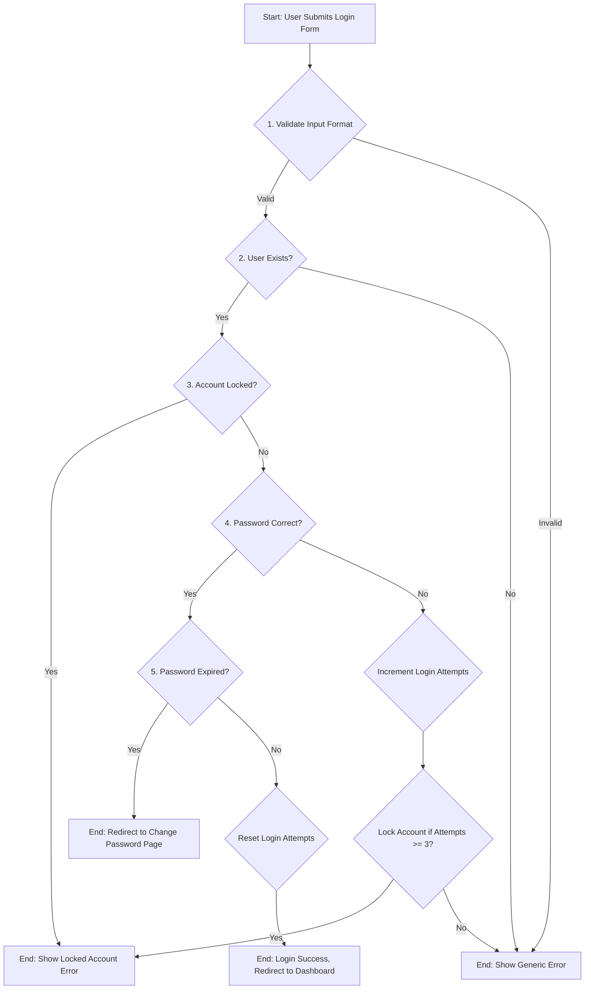

# Behavioural Model: User Authentication Flow

This document provides a formal behavioural model of the user authentication process in PixelForge Nexus. It uses a flowchart to specify the system's behaviour in response to a user login attempt. This model allows for clear verification of the system's logic against its security and functional requirements.

## Authentication Flowchart

The following flowchart describes the step-by-step process the system follows when a user submits their credentials on the login page.

## Verification of Correctness

This model can be verified against the system's key security specifications:

1.  **Input Validation**: The flow begins with an explicit input validation step (B). **VERIFIED**.
2.  **User Enumeration Prevention**: If a user does not exist (C) or the password is incorrect (E), the system follows a path that results in the same outcome: a generic error message (F). This prevents an attacker from determining which usernames are valid. **VERIFIED**.
3.  **Brute-Force Protection**: The model includes steps to increment failed login attempts (I) and lock the account (J) if the threshold is met. **VERIFIED**.
4.  **Account Lockout**: The flow explicitly checks if an account is already locked (D) at the beginning of the process for an existing user. **VERIFIED**.
5.  **Password Expiration**: The system checks for password expiry (H) only after a successful password verification, ensuring this check does not leak information. **VERIFIED**.
6.  **Successful Login Path**: The only path to a successful login (M) requires passing all preceding checks. It also includes resetting the login attempt counter (L) as a final step. **VERIFIED**.

This formal model demonstrates that the designed authentication flow correctly implements the specified security mechanisms and handles all primary success and failure states as intended.
