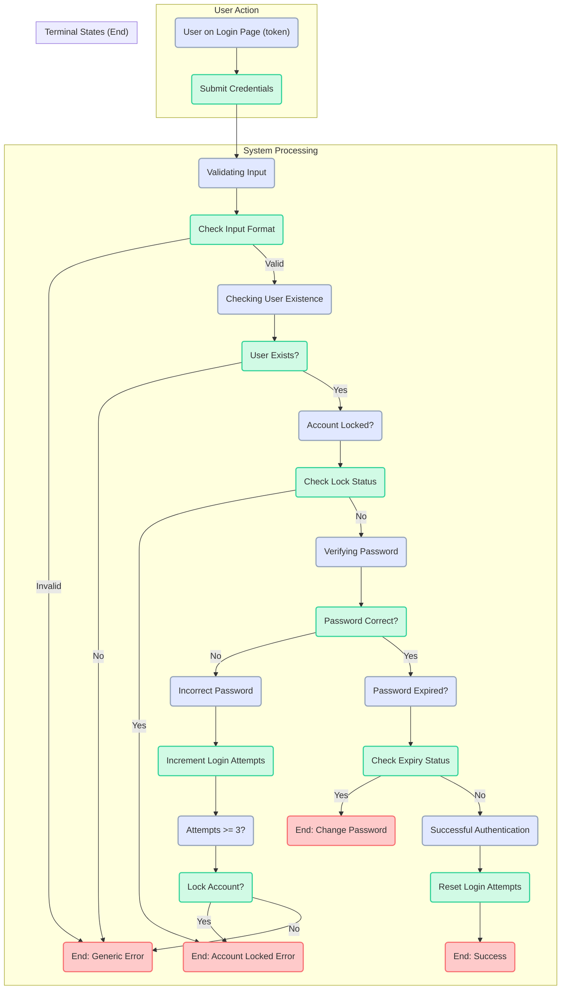

# Behavioural Model: User Authentication Flow

This document provides a formal behavioural model of the user authentication process in PixelForge Nexus. It uses a **Petri net** to specify the system's behaviour in response to a user login attempt. This model allows for clear verification of the system's logic against its security and functional requirements by representing states (places) and actions (transitions).

## Authentication Flow Petri Net

The following Petri net describes the step-by-step process the system follows when a user submits their credentials on the login page. A token moving through the net represents the progression of a single login attempt.

## Verification of Correctness

This model can be verified against the system's key security specifications:

1.  **Input Validation**: The flow begins with an explicit input validation transition (T2_ValidateInput). **VERIFIED**.
2.  **User Enumeration Prevention**: An invalid username (T3_CheckUser) or an incorrect password (leading from T5_CheckPass) both eventually lead to the same terminal state (P_End_GenericError). This prevents an attacker from distinguishing between an invalid user and an incorrect password. **VERIFIED**.
3.  **Brute-Force Protection**: The model includes transitions to increment failed login attempts (T6_IncrementAttempts) and lock the account (T7_LockAccount) if the threshold is met, leading to the "Locked" state. **VERIFIED**.
4.  **Account Lockout**: The flow explicitly checks if an account is already locked (T4_CheckLock) at the beginning of the process for an existing user. **VERIFIED**.
5.  **Password Expiration**: The system checks for password expiry (T8_CheckExpiry) only after a successful password verification (T5_CheckPass), ensuring this check does not leak information about password validity. **VERIFIED**.
6.  **Successful Login Path**: The only path to a successful login (P_End_LoginSuccess) requires passing all preceding checks and includes resetting the login attempt counter (T9_ResetAttempts) as a final action. **VERIFIED**.

This formal model demonstrates that the designed authentication flow correctly implements the specified security mechanisms and handles all primary success and failure states as intended.
