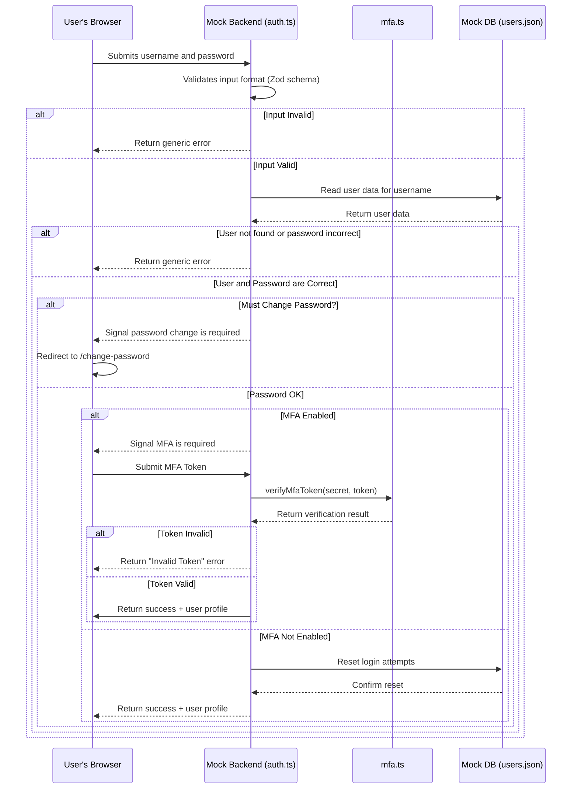

# SDLC Stage 3: Architecture and Design

This document details the architecture and design of the PixelForge Nexus application, focusing on how security principles are embedded into its foundation.

## 3.1 Architecture Phase

### System Architecture
The application is designed as a modern, client-server web application.

- **Frontend (Client)**: A **Next.js (React)** single-page application (SPA). It uses server components to improve performance and reduce the client-side JavaScript bundle size. The UI is built with **ShadCN components** and styled with **Tailwind CSS**.
- **Backend (Server-Side Logic)**: For this prototype, the backend is **mocked within the Next.js application** itself in `src/lib/`. The `auth.ts` file acts as the primary service for user management and authentication, while the `projects.ts` file defines project-related data models. A new `mfa.ts` service has been added to encapsulate all Multi-Factor Authentication logic, promoting separation of concerns. Data is persisted in a mock `users.json` file.
- **Data Flow**: The client-side components make asynchronous calls to the "server" functions in `src/lib/`. These functions read from and write to the `users.json` file (for user data) or browser `localStorage` (for project data), simulating a full-stack data flow.

### Data Encryption Strategy
A comprehensive data encryption strategy is fundamental to the application's design, addressing both data in transit and data at rest.

-   **Data in Transit**: All communication between the client (user's browser) and the server must be encrypted using **HTTPS (TLS)**. This is a non-negotiable requirement for the production environment, ensuring that sensitive information like passwords, session tokens, and personal data cannot be intercepted and read by attackers on the network.
-   **Data at Rest**: Sensitive data stored on the server must be protected from unauthorized access, even in the event of a direct database breach. Our strategy includes:
    1.  **Password Hashing**: We do not store user passwords. Instead, we store a secure, salted hash of the password using a strong, slow algorithm like **bcrypt** or **Argon2** (simulated in this prototype). This makes it computationally infeasible to reverse the hash and recover the original password.
    2.  **Encryption of Secrets**: Other highly sensitive data, such as the **MFA secret key** for a user, must be encrypted at rest in the database. This provides an additional layer of protection beyond database-level access controls.

### Integration with Existing Infrastructure
- **Self-Contained Application**: The application is designed to be largely self-contained. This means it does not have complex dependencies on other enterprise systems, such as a separate corporate user directory or a dedicated database server. All logic for handling users and projects is included within the application's own codebase.
- **Node.js Runtime Environment**: The fundamental infrastructure requirement is a **Node.js environment**. Next.js is a framework that runs on Node.js, which allows it to execute JavaScript on the server to handle API requests, render pages, and run the business logic defined in `src/lib/`. The application cannot run without it.
- **Environment Variables for Configuration**: The primary method for integrating with external services (like Google AI for Genkit) is through environment variables. These are managed in a `.env.local` file for local development. This approach separates sensitive configuration (like API keys) from the source code, which is a critical security and operational best practice.

### Security by Design Principles
The architecture is founded on core security principles, following industry best practices from **OWASP** and **NIST**.

1.  **Defense in Depth**: Security is applied in layers to minimize the attack surface.
    - **Client-Side**: Input validation in forms (using Zod) provides immediate user feedback. UI components are conditionally rendered based on user roles, preventing users from seeing options they are not authorized to use.
    - **Server-Side**: The same validation rules are re-enforced on the mock backend (`auth.ts`), serving as the authoritative layer of defense against any client-side bypass attempts.
2.  **Principle of Least Privilege**: The entire application is built around a strict Role-Based Access Control (RBAC) model. Each role (`admin`, `project-lead`, `developer`) is granted the absolute minimum set of permissions required to perform its function. For example, a `developer` cannot even see the API endpoint logic for deleting a project. This directly supports the **Confidentiality** and **Integrity** goals of the CIA triad.
3.  **Secure Defaults**: The default state of the application is the most secure state. Public registration is disabled, new users must be explicitly created by an administrator, and they are forced to change their default password on first login. Multi-Factor Authentication is an opt-in feature, allowing for a better user experience while still providing enhanced security for those who need it.

## 3.2 Design Phase

### Application Structure Blueprint
The application is structured logically to separate concerns:

- **`/src/app/`**: Contains the main application routes (pages) and layouts, following the Next.js App Router convention.
- **`/src/components/`**: Houses all reusable React components. UI-specific components from ShadCN are in `/src/components/ui/`.
- **`/src/lib/`**: Contains the core business logic and mock backend services (`auth.ts`, `projects.ts`, `logger.ts`, and the new `mfa.ts`). This isolates the application's "server-side" logic.
- **`/src/context/`**: Manages global state, specifically authentication (`auth-context.tsx`).
- **`/docs/`**: Contains all project documentation, including SDLC files and formal models.

### Data Flow Diagram (Authentication with MFA)
This sequence diagram shows the flow of messages between system components during an authentication attempt. It illustrates the sequence of operations but does not model the internal state logic. For a formal model of the system's state transitions, see the Petri net in `BEHAVIOURAL_MODEL.md`.

### Threat Modeling
A simplified threat modeling exercise was performed using the **STRIDE** model as a guide.

- **Spoofing**: Threat of a user impersonating another.
  - **Mitigation**: Strong password policies (enforced by schema) and a secure login process. The addition of **optional Multi-Factor Authentication** provides a powerful second layer of defense against password-based attacks.
- **Tampering**: Threat of unauthorized data modification.
  - **Mitigation**: Strict, server-side RBAC ensures only authorized users can modify specific data (e.g., only an Admin can change a user's role). This is implemented in `src/lib/auth.ts` in functions like `updateUserRole`.
- **Repudiation**: A user denying they performed an action.
  - **Mitigation**: In a real app, this would be addressed with comprehensive audit logging. For this prototype, the centralized `logger.ts` service provides a foundation for this, logging key events to the console.
- **Information Disclosure**: Threat of exposing sensitive data to unauthorized users.
  - **Mitigation**: RBAC ensures users only see data they are assigned to. **HTTPS** prevents data interception. **Crucially, the MFA secret is stored on the backend and never sent to the client.** The backend also never sends sensitive data (like password hashes) to the client.
- **Denial of Service**: Threat of making the system unavailable.
  - **Mitigation**: The account lockout mechanism in `src/lib/auth.ts` protects against brute-force login attacks, contributing to **Availability**. The MFA verification endpoint would also need rate limiting in a production environment to prevent token-guessing attacks.
- **Elevation of Privilege**: A user gaining higher-level permissions.
  - **Mitigation**: This is the most critical threat addressed. Every sensitive action is validated on the server against the user's role, preventing a user from bypassing client-side UI restrictions to perform unauthorized actions. This is the core of our **Authorization** strategy.

    