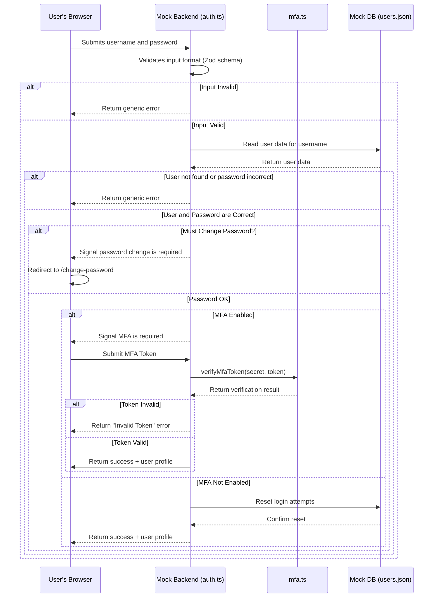

# SDLC Stage 3: Architecture and Design

This document details the architecture and design of the PixelForge Nexus application, focusing on how security principles are embedded into its foundation.

## 3.1 Architecture Phase

### System Architecture
The application is designed as a modern, client-server web application.

- **Frontend (Client)**: A **Next.js (React)** single-page application (SPA). It uses server components to improve performance and reduce the client-side JavaScript bundle size. The UI is built with **ShadCN components** and styled with **Tailwind CSS**.
- **Backend (Server-Side Logic)**: For this prototype, the backend is **mocked within the Next.js application** itself in `src/lib/`. The `auth.ts` file acts as the primary service for user management and authentication, while the `projects.ts` file defines project-related data models. A new `mfa.ts` service has been added to encapsulate all Multi-Factor Authentication logic, promoting separation of concerns. Data is persisted in a mock `users.json` file.
- **Data Flow**: The client-side components make asynchronous calls to the "server" functions in `src/lib/`. These functions read from and write to the `users.json` file (for user data) or browser `localStorage` (for project data), simulating a full-stack data flow.

### Integration with Existing Infrastructure
- **Self-Contained Application**: The application is designed to be largely self-contained. This means it does not have complex dependencies on other enterprise systems, such as a separate corporate user directory or a dedicated database server. All logic for handling users and projects is included within the application's own codebase.
- **Node.js Runtime Environment**: The fundamental infrastructure requirement is a **Node.js environment**. Next.js is a framework that runs on Node.js, which allows it to execute JavaScript on the server to handle API requests, render pages, and run the business logic defined in `src/lib/`. The application cannot run without it.
- **Environment Variables for Configuration**: The primary method for integrating with external services (like Google AI for Genkit) is through environment variables. These are managed in a `.env.local` file for local development. This approach separates sensitive configuration (like API keys) from the source code, which is a critical security and operational best practice.

### Security by Design Principles
The architecture is founded on core security principles:

1.  **Defense in Depth**: Security is applied in layers.
    - **Client-Side**: Input validation in forms (using Zod) provides immediate user feedback.
    - **Server-Side**: The same validation rules are re-enforced on the mock backend (`auth.ts`), serving as the authoritative layer of defense.
    - **UI**: Components are conditionally rendered based on user roles, preventing users from seeing options they are not authorized to use.
2.  **Principle of Least Privilege**: The entire application is built around a strict Role-Based Access Control (RBAC) model. Each role (`admin`, `project-lead`, `developer`) is granted the absolute minimum set of permissions required to perform its function. For example, a `developer` cannot even see the API endpoint logic for deleting a project.
3.  **Secure Defaults**: The default state of the application is the most secure state. Public registration is disabled, and new users must be explicitly created by an administrator. Multi-Factor Authentication is disabled by default and is an opt-in feature for users.

## 3.2 Design Phase

### Application Structure Blueprint
The application is structured logically to separate concerns:

- **`/src/app/`**: Contains the main application routes (pages) and layouts, following the Next.js App Router convention.
- **`/src/components/`**: Houses all reusable React components. UI-specific components from ShadCN are in `/src/components/ui/`.
- **`/src/lib/`**: Contains the core business logic and mock backend services (`auth.ts`, `projects.ts`, `logger.ts`, and the new `mfa.ts`). This isolates the application's "server-side" logic.
- **`/src/context/`**: Manages global state, specifically authentication (`auth-context.tsx`).
- **`/docs/`**: Contains all project documentation, including SDLC files and formal models.

### Data Flow Diagram (Authentication with MFA)
This diagram shows the updated flow for a user login attempt, including the MFA step.

### Threat Modeling
A simplified threat modeling exercise was performed using the **STRIDE** model as a guide.

- **Spoofing**: Threat of a user impersonating another.
  - **Mitigation**: Strong password policies (enforced by schema) and a secure login process. The addition of **optional Multi-Factor Authentication** provides a powerful second layer of defense against password-based attacks.
- **Tampering**: Threat of unauthorized data modification.
  - **Mitigation**: Strict, server-side RBAC ensures only authorized users can modify specific data (e.g., only an Admin can change a user's role). This is implemented in `src/lib/auth.ts` in functions like `updateUserRole`.
- **Repudiation**: A user denying they performed an action.
  - **Mitigation**: In a real app, this would be addressed with comprehensive audit logging. For this prototype, the centralized `logger.ts` service provides a foundation for this, logging key events to the console.
- **Information Disclosure**: Threat of exposing sensitive data to unauthorized users.
  - **Mitigation**: RBAC ensures users only see data they are assigned to. HTTPS (assumed standard) prevents data interception. **Crucially, the MFA secret is stored on the backend and never sent to the client.** The backend also never sends sensitive data (like password hashes) to the client.
- **Denial of Service**: Threat of making the system unavailable.
  - **Mitigation**: The account lockout mechanism in `src/lib/auth.ts` protects against brute-force login attacks. The MFA verification endpoint would also need rate limiting in a production environment to prevent token-guessing attacks.
- **Elevation of Privilege**: A user gaining higher-level permissions.
  - **Mitigation**: This is the most critical threat addressed. Every sensitive action is validated on the server against the user's role, preventing a user from bypassing client-side UI restrictions to perform unauthorized actions. For example, the `handleDeleteDocument` function in `src/app/dashboard/page.tsx` is only callable if the user has the correct permissions, which are checked via the `canManageDocs` flag.
